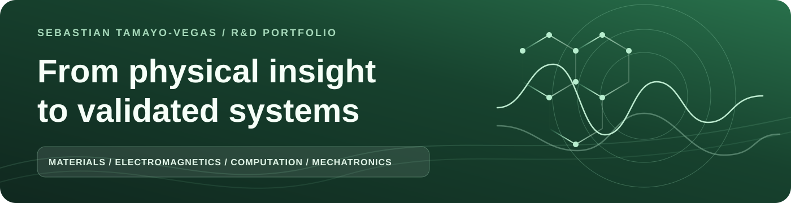
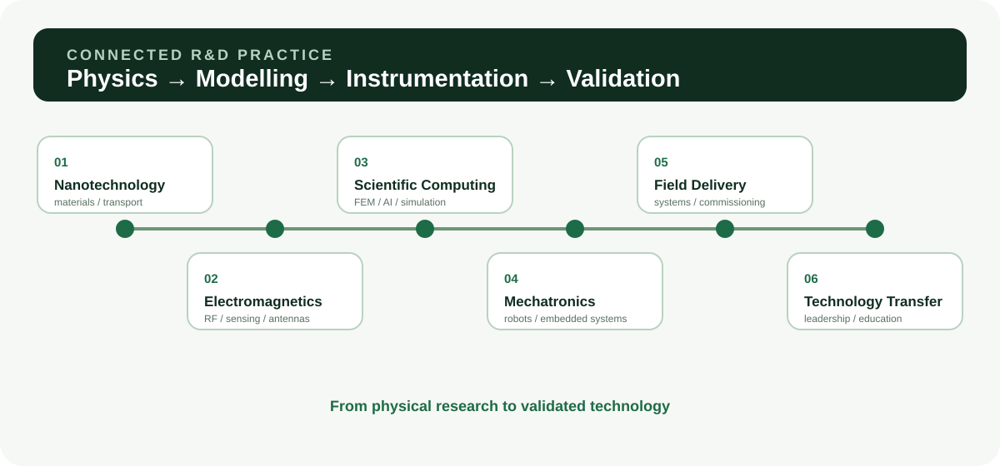
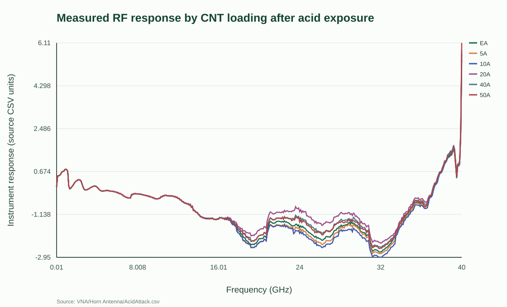
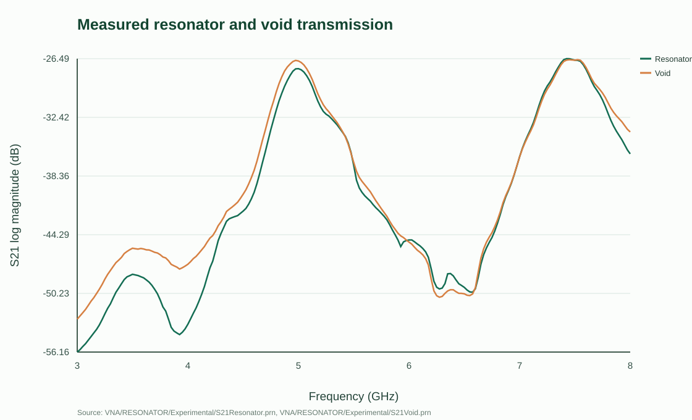
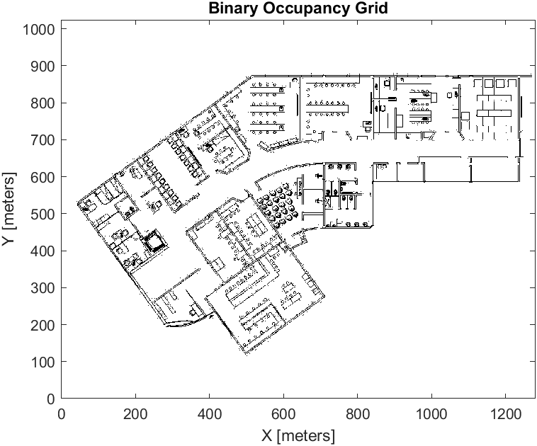
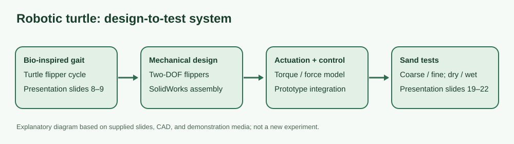
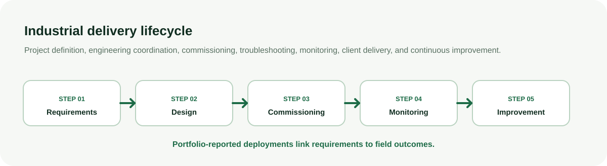
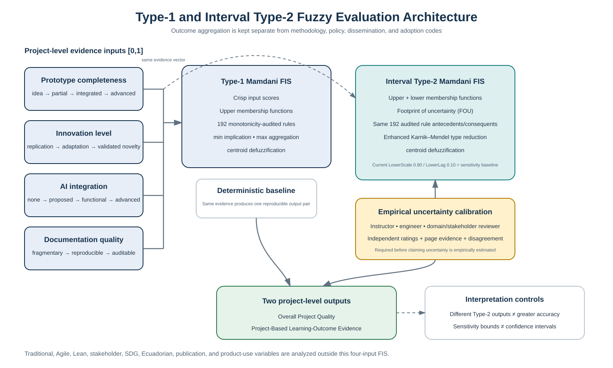

  
  <h1>Sebastian Tamayo-Vegas</h1>
  
<strong>Scientist-engineer connecting physical science with working systems</strong> Nanomaterials · Electromagnetics · Scientific computing · Mechatronics

  

    
    
    
     
    
    
  

## About

High-performing, UK-trained R&D Scientist-Engineer specializing in advanced science and engineering, with a proven record of technical distinction, measurable industry impact, and international recognition across 10+ years of multidisciplinary engineering and 8+ years of applied R&D.

I bridge advanced science, multidisciplinary engineering, project management, Lean improvement, and innovation to transform complex physical problems into validated technologies and product-ready systems. 

I lead work across the complete development lifecycle—from requirements, feasibility studies, and computational modeling to design, simulation, prototyping, testing, validation, documentation, and delivery.

My expertise integrates electromagnetics, RF, MEMS, sensors, nanotechnology mechatronics, systems engineering, scientific computing, Multiphysics modeling, robotics, and Physical AI.

My research and development combine electromagnetic, mechanical, diffusion, electrical-network, and materials models with experimental measurements. I have designed and validated RF sensing architectures, antennas, resonators, nanocomposite materials, embedded systems, autonomous platforms, and AI-enabled engineering applications.

My focus is move scientific research toward reliable products and real-world deploymen

<strong>Physics → modelling → instrumentation → validation</strong>

<strong>🧭 Quick navigation</strong> 
<a href="#about">About</a> · <a href="#science--engineering-stack">Science &amp; Engineering Stack</a> · <a href="#six-research-areas">Six Research Areas</a> · <a href="#skills--interests">Skills &amp; Interests</a> · <a href="#connect">Connect</a>

---

## Six Research Areas

The six areas organize my portfolio, but their projects have different evidence and maturity. Select an area to jump to its highlighted work.

| Area | Representative work |
| :-- | :-- |
| [🔬 **01 · Advanced Science Nanotechnology**](#advanced-science-nanotechnology) | CNT/epoxy degradation, agglomeration, and temperature-dependent mechanics. |
| [📡 **02 · Advanced Science Electromagnetism**](#advanced-science-electromagnetism) | Antennas, resonators, VNA processing, and contactless sensing. |
| [🧮 **03 · Scientific Computing and Computational Engineering**](#scientific-computing-and-computational-engineering) | RVE/FEA, DEM, motion planning, numerical comparison, and AI workflows. |
| [🤖 **04 · Advanced Mechatronics Engineering**](#advanced-mechatronics-engineering) | Integrated robotic mechanisms, electronics, control, and prototypes. |
| [🏭 **05 · Industrial Engineering and Field Delivery**](#industrial-engineering-and-field-delivery) | Commissioning, monitoring, telecommunications, and project delivery. |
| [🤝 **06 · Leadership, Project Management Engineering and Technology Transfer**](#leadership-project-management-engineering-and-technology-transfer) | Research coordination, laboratories, education, and technology transfer. |

The visuals below are measurement-derived plots, computational output, or explanatory diagrams—not interchangeable forms of evidence. Their sources and limitations are in the [figure provenance notes](docs/figure-provenance.md).
## Science & Engineering Stack

### Programming languages

  
  
  
  
  

### Methods, instruments, and platforms

| Layer | What I use it for |
| :-- | :-- |
|  **RVE & multiscale materials** | Microstructure, agglomeration, micromechanics, and conductivity/percolation models. |
|  **FEM / FEA** | Mechanical, diffusion, and electromagnetic field modelling; comparison with experiments. |
|  **DEM** | Particle-contact modelling, including the supplied backhoe-tooth wear study. |
|  **RF & materials characterization** | Antennas, resonators, VNA/NanoVNA S-parameters, DMA, nanoindentation, and conductivity measurements. |
|  **AI & physical AI** | RAG and PINN research workflows, applied ML/DL and computer vision, and Omniverse/Isaac Sim/Jetson education and prototyping. |

**Engineering software:** MATLAB · Python · CST Studio Suite · ANSYS HFSS · COMSOL · Abaqus · SolidWorks. Tool mentions describe the supplied research and portfolio work; they are not a claim that every tool was used in every project.
### Advanced Science Nanotechnology

I connect changes in a CNT/epoxy nanocomposite's physical state to its mechanical, electrical, and RF response.

| Highlight | Evidence |
| :-- | :-- |
| **Acid exposure and contactless characterization** | Experimental RF response and multiscale interpretation; [published study](https://doi.org/10.1016/j.compstruct.2022.116508). |
| **Agglomeration and temperature effects** | Conductivity/DMA comparisons with RVE, FEA, and electrical models; [agglomeration study](https://doi.org/10.3390/polym14091842) and [temperature study](https://doi.org/10.1016/j.matpr.2022.01.480). |

<strong>Explore the supplied acid-exposure RF data</strong>

**Evidence:** measurement-derived preview re-plotted from `VNA/Horn Antenna/AcidAttack.csv`; it is not a figure reproduced from the paper. The archived CSV does not independently establish all specimen-preparation, calibration, or response-unit details.

### Advanced Science Electromagnetism

The research connects electromagnetic design with instrument readings, especially where a material or void changes a resonant response.

| Highlight | Evidence |
| :-- | :-- |
| **Antennas and chipless resonators** | Patch, helical, and Vivaldi models, fabrication records, and scattering/RCS results; simulated and measured evidence. |
| **VNA/NanoVNA processing** | Original S-parameter logs, measurement notebooks, and acquisition-to-analysis workflows. |

<strong>Explore measured resonator-versus-void transmission</strong>

**Evidence:** experimental S21 traces re-plotted from the supplied PRN files. This compares acquired transmission in dB; it is not a simulation prediction or a new measurement campaign.

### Scientific Computing and Computational Engineering

I use scientific code to test explanations against data, then make the modelling assumptions and comparisons visible.

| Highlight | Evidence |
| :-- | :-- |
| **CNT multiscale models** | RVE/FEA, resistor networks, simulation tables, and model-versus-experiment figures. |
| **DEM and motion planning** | Backhoe-tooth wear study and supplied MATLAB map-processing experiments; simulation and computational outputs. |
| **AI research workflows** | PINN computational work and MATLAB/Python retrieval prototypes; methods and exploratory implementations. |

<strong>Explore a supplied motion-planning map processed in MATLAB</strong>

**Evidence:** generated computational output from the archived `Plano.jpg` map and MATLAB `Grid1.m` workflow. The grid demonstrates map processing; no independently calibrated physical distance or robot-performance result is claimed by this preview.

### Advanced Mechatronics Engineering

**Robotic-turtle concept/prototype:** a sand-walking mechanism that brings structure, actuation, electronics, sensing, and control into one engineering system.

| Project material | What it documents |
| :-- | :-- |
| Presentation, CAD, calculations, and demonstration media | Design and prototype evidence; no unverified speed, endurance, or field-performance claim. |

<strong>Explore the robotic-turtle system</strong>

**Evidence:** explanatory system diagram derived from supplied design material. The project is presented as a concept/prototype, not a validated commercial robot.

### Industrial Engineering and Field Delivery

This area follows requirements through design, commissioning, monitoring, and improvement. The outcomes below are **portfolio-reported project records**, not laboratory datasets.

| Field thread | Evidence status |
| :-- | :-- |
| Elevator monitoring and electromechanical commissioning | Portfolio-reported installations and service workflow. |
| PetroEcuador, telecommunications, and manufacturing transport | Portfolio-reported engineering delivery and implementation records. |

<strong>Explore the field-delivery lifecycle</strong>

**Evidence:** original explanatory diagram reflecting the supplied professional portfolio; it is not a measured performance chart. Project-specific outcomes should be read in their original records.

### Leadership, Project Management Engineering and Technology Transfer

I connect individual investigations to teams, laboratories, education, and applied transfer—not only to publications or prototypes.

| Highlight | Evidence status |
| :-- | :-- |
| Hybrid-education fuzzy evaluation | Supplied Type-1/Type-2 FIS models, MATLAB methods, evaluation data, and reported results. |
| NVIDIA simulation and physical-AI education | Portfolio-reported Omniverse, Isaac Sim, and Jetson workshops, supervision, and technology transfer. |

<strong>Explore the fuzzy-evaluation architecture</strong>

**Evidence:** explanatory architecture based on the supplied FIS models and implementation, not an experimental outcome plot. The education evaluation is distinct from the materials and RF research above.

## Skills & Interests

| 🔭 Research skill | 🌱 Where I want to keep building |
| :-- | :-- |
| **Material-to-signal reasoning** — connecting nanocomposite morphology, transport, mechanics, and RF response. | Contactless monitoring of materials in harsh environments. |
| **Model–measurement comparison** — testing RVE/FEA, diffusion, electrical, and electromagnetic models against experiments. | Reproducible multiphysics workflows and trustworthy scientific computing. |
| **Instrument-to-system integration** — moving from VNA data and resonant structures to sensing concepts and prototypes. | Wireless/passive sensing, embedded intelligence, and mechatronic systems. |
| **Research-to-team transfer** — scientific programming, laboratories, teaching, and multidisciplinary delivery. | AI-assisted engineering, physical AI, and collaborations that reach real deployments. |

## Connect

I welcome research and engineering conversations about contactless sensing, computational materials, RF instrumentation, robotics, and research-to-prototype collaboration.

✉️ [Email](mailto:mstv.engineering@gmail.com) · 🐙 [GitHub](https://github.com/tamayovegas) · 🤝 [LinkedIn](https://www.linkedin.com/in/sebastian-tamayo) · 🔬 [Research website](https://tamayovegas.com/) · 📖 [Blog](https://www.bambootech.space/)

Profile visuals are local copies of measurement-derived plots, computational output, or explanatory diagrams from the organized portfolio. See the [provenance notes](docs/figure-provenance.md) for each source and interpretation.
